# goodluckOS
An uncompromisingly fast, small, modern, and feature-rich custom firmware for A23/A33-based handheld consoles.

> **About this fork:** this is a fork of [CodeZombie/goodluckOS](https://github.com/CodeZombie/goodluckOS) with fixes for the GA36-MB v1.1 and a reworked launcher, System Settings and translations. Everything in it was vibe coded: written with an AI coding assistant (Claude Code), with me describing what I wanted, testing every change on my own device and steering the result. I picked up AI tools at work and, honestly, now I can barely code without them. So read the code with that in mind, and expect bugs. Changes go back upstream as small, separate pull requests, each one saying it was AI-assisted. What's here and where each change stands is in the [fork changelog](FORK-CHANGELOG.md): it is all under review and testing, so if you install it, you do so at your own risk.

## PLEASE READ
goodluckOS is PRE-RELEASE software. There are no gaurantees that it will work on your hardware.

Please visit [The Firmware Builder](https://codezombie.github.io/goodluckOS/download.html). This will walk you through the steps of identifying if you have a compatible unit, and if so, easily building a bootable goodluckOS image.

Please Note: At the time of writing, Allwinner-A23 based GA36-MB devices (which seem to be what most people have) are _not_ supported.

## Features
- Mainline Linux 7.2
- Everything compiled from scratch with the best optimization flags for the hardware
- Optimized for performance. No systemd, no unecessary background processes, no x11/wayland
- Significantly smaller and faster than the stock firmware
- Boots in 10 seconds (stock firmware takes 50)
- Can be flashed to a 1gb SD card and still give you over 500mb of free space for games
- ZRAM enabled by default
- Hardware accelerated graphics
- Speaker and headphone audio. The speaker gets a high-pass filter, so it stays clean instead of distorting on bass it can't play
- Great battery life
- No swap on SD card (massively improves the life of your card over the stock f/w)
- Built-in `Resize Home` app which grows your HOME partition to fill all the available space on your microSD card.
- Volume buttons change the volume and FN+Vol the screen brightness from anywhere, with a level bar shown over whatever is on screen: the launcher, the settings or any game
- Optional in-game status bar with the date and time, the battery, the volume and the audio output, over any game
- Date and time with a time zone, kept while the console is off, shown in the launcher and the status bar (12/24-hour, several date formats)
- Brightness, volume and CPU mode are kept across reboots
- SELECT+START closes the active application cleanly (RetroArch saves first), bringing you right back to the launcher
- FN+START+SELECT force-kills the active application
- FN+DPAD_UP toggles a live FPS/CPU graph for monitoring in-game performance. What it shows, its style and its corner are set in System Settings -> Overlay.
- FN+DPAD_DOWN switches the sound between the speaker and the headphones only
- If the screen is on, the LEDs are off. Nothing blinding you while you're playing in the dark
- Comes stock with Chocolate Doom, ready to play
- Comes stock with Retroarch and several optimized cores (PCSX-ReArmed, Snes9x, QuickNES, DOSbox, Genesis Plus GX, mGBA, etc)
- Games perform very well. Metal Gear Solid 1 is completely playable at reasonable framerates
- Comes with a custom, optimized launcher application, with tabs per system, search, favourites and game artwork/descriptions from `gamelist.xml`
- System Settings app: brightness, volume, audio output, launcher options, language, interface font, overlay, date and time, performance mode, system info, a button tester and a restore of the default settings
- Translatable interface, with English and Brazilian Portuguese included (see [Translations](#translations))
- Autostart any application on boot, including games or a front-end like EmulationStation (coming soon)
- USB terminal access for remote debugging. Log in with `sudo screen /dev/ttyACM* 115200` and `root:root`
- HOME shows up on your PC over USB (MTP), like a phone: copy games and saves without taking the SD card out
- Half Life 1 ported and playable: [Get It Here](https://github.com/CodeZombie/glOSports-half-life)

### Features In Development
- Portmaster (or equivalent)
- EmulationStation
- USB Networking
- Headphone support
- GA36-MB TF-2 support (If the hardware supports it)
- CPU overclocking
- Improve performance of PPSSPP emulator core. 
- Portable Puppy for other firmwares (see below; config file, es_systems.cfg support and runner done)

### Portable Puppy (in development)
Puppy can also run as an optional frontend on other handheld firmwares that use EmulationStation (e.g. dArkOS on the original R36S, ROCKNIX, Knulli), next to the existing frontends rather than replacing them. Progress:
1. **Config file (`puppy.conf`)** - done: fonts, assets, languages, where `apps.puppy`, the cache and the settings live, and the commands for restart / power off / display off / settings. Without one, Puppy uses the goodluckOS defaults, so goodluckOS works exactly as before. Puppy reads the file given with `--config`, else `$PUPPY_CONFIG`, else `/etc/puppy.conf`. A documented example is in [`rootfs/package/puppy/portable/puppy.conf`](rootfs/package/puppy/portable/puppy.conf).
2. **Systems from `es_systems.cfg`** - done: the tabs come from the EmulationStation system list the firmware already has (folders, extensions and launch commands, with `%ROM%`, `%BASENAME%`, `%SYSTEM%`, and the default `%EMULATOR%` / `%CORE%` of ES forks that have a core choice), so it works with no manual setup. Systems without games are left out, and scraped `gamelist.xml` collections work as on goodluckOS.
3. **Self-contained launching** - done: [`puppy-run.sh`](rootfs/package/puppy/portable/puppy-run.sh) shows Puppy, runs what was picked and comes back, like `puppy-bootstrap.sh` does on goodluckOS. A "Quit Puppy" power option (`quit = on`) goes back to the frontend Puppy was started from. Without a settings app, START opens the power options.
4. **aarch64 build and packaging** - to do: 64-bit builds for RK3326 devices (built against an older glibc, or with the libraries shipped next to Puppy in `libs/`), an install script, and a PortMaster package.

The portable folder looks like this: `puppy`, `puppy-run.sh`, `puppy.conf`, `assets/` (`Inter_24pt-Medium.ttf`, `fallback.png`), `lang/` (the `.lang` files) and an optional `apps/` folder of `*.puppy` files. So far it has been tested only on a PC with an ArkOS-style `es_systems.cfg`. Step 4 needs testers with an original R36S or other RK3326 device: if that's you, open an issue!

## Supported Devices
- GA36-MB v1.2
- GA36-MB v1.1

#### Coming Soon:
- GA36-MB v1.0
- F35v
- Other A23/A33-based devices

Know of another Allwinner-based handheld not listed on this page? Open a new [Issue](https://github.com/CodeZombie/goodluckOS/issues) and let me know!

Consider contributing to the [Device Fund](https://ko-fi.com/jeremyclark) so I can purchase new consoles and port goodluckOS to them.

## Puppy
Puppy is goodluckOS' application launcher. It's what you see when you start goodluckOS.

| Grid view | List view |
| --- | --- |
| 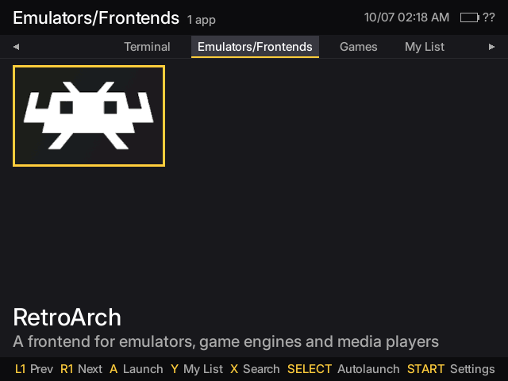 | 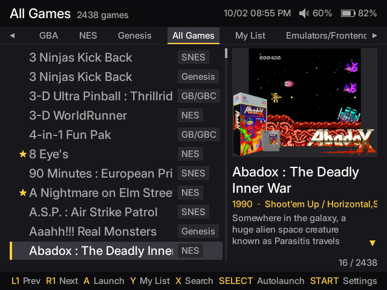 |

The top bar shows the volume (a headphones icon when the sound goes to the headphones only) and the battery, whose level turns yellow while charging, green when full and red at 10% or less.

Changing the brightness (FN+Vol) or the volume shows a level bar for a moment, and FN + D-pad down shows the audio output. It is drawn by the graphics driver (a patch to Mesa's Gallium HUD), so it looks the same over the launcher, the settings and every game:

| Brightness | Volume | Audio output |
| --- | --- | --- |
| 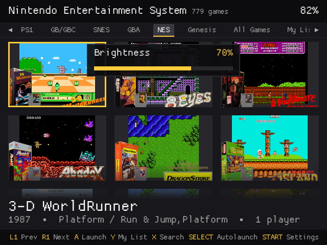 | 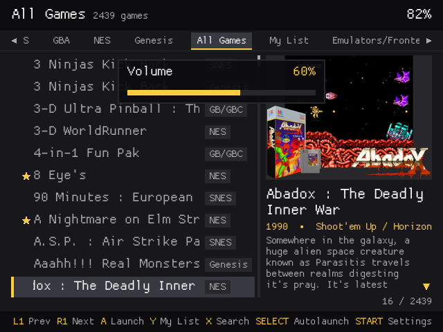 | 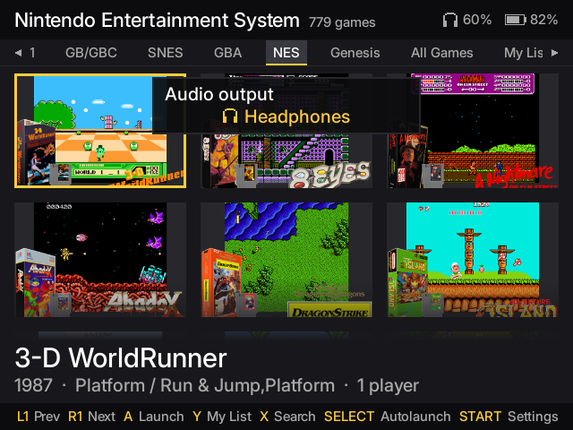 |

It starts up fast, uses very little power, launches applications instantly, and uses zero RAM and CPU after launching an application.

Puppy uses a ini-formatted `apps.puppy` files to populate it's application list. 

Add a new entry by modifying the `apps.puppy` file in your HOME partition. Take a look at the comments at the top of that file for syntax/examples

Works with scraped collections: point Skraper (or anything that writes EmulationStation's `gamelist.xml`) at your rom folders and Puppy shows the games' names, artwork, descriptions and year/genre/players, no conversion needed (see [How do I add games?](#how-do-i-add-games)).

Each system and app category gets its own tab, plus an "All Games" tab with every system's games and a "My List" tab with your favourites. Controls:

| Button | Action |
|---|---|
| L1 / R1 | Previous / next tab |
| D-pad / left stick | Move (hold to scroll). In list view, left/right jump a page |
| Right stick up/down | Scroll the game's description (list view) |
| A | Launch |
| Y | Add to / remove from My List (your favourites tab) |
| SELECT | Set / clear autolaunch |
| L2 + R2 | Game options: **Rename** the game with the on-screen keyboard, starting from the name it shows (L1/R1 move the cursor, Aa types capitals): the shown name changes and the file takes a version of it the card accepts (":" becomes " -"), with its cover, gamelist entry and RetroArch saves following, or **Move to trash** (`HOME/.trash`; a `.cue`'s tracks and a `.m3u`'s discs go with it). System Settings empties the trash |
| X | Search by name with the on-screen keyboard (the search applies to every tab) |
| B | Clear the search, or close the keyboard / power options |
| START | System Settings |
| POWER | Power options: display off, restart, shut down |

Grid or list view, whether the tabs are shown and which ones are set in System Settings. In list view, a selected name that doesn't fit scrolls to show the rest.

### Shortcuts that work everywhere
| Buttons | Action |
|---|---|
| VOL+ / VOL- | Volume, with an on-screen level bar |
| FN + VOL+ / VOL- | Brightness, with an on-screen level bar |
| POWER | Screen off / on (in the launcher it opens the power options) |
| SELECT + START | Close the active app cleanly (RetroArch saves first) and go back to the launcher |
| FN + SELECT + START | Force close the active app |
| FN + D-pad up | Show / hide a live FPS and CPU overlay |
| FN + D-pad down | Sound on the speaker or on the headphones only (the console can't detect headphones, so this is manual) |

### RetroArch
FN is the hotkey:

| Buttons | Action |
|---|---|
| FN + X | RetroArch menu |
| FN + R1 / L1 | Save / load state |
| FN + LEFT / RIGHT | Previous / next state slot |
| FN + Y | Pause |
| FN + R2 | Fast forward |
| FN + START | Quit the game |

The same list is in System Settings -> Input Settings, next to a button tester.

## System Settings
Opened with START from the launcher. Its main page is a menu of sections, each with its own page:

```
System Settings
├── Display & Audio
│   ├── Brightness
│   ├── Master Volume
│   ├── Global Mute
│   └── Audio output: Speaker / Headphones
├── Launcher
│   ├── Show launcher tabs
│   ├── Launcher view: Grid / List
│   └── Launcher tabs ─ which tabs to show
├── Interface
│   ├── Language
│   └── Font
├── Overlay
│   ├── In-game status bar
│   ├── Show: Battery and audio / Battery only
│   ├── Opacity
│   └── Performance (FN + UP)
│       ├── Show on game start
│       ├── Content: FPS / FPS + CPU
│       ├── Style: Graph / Text
│       └── Position: top or bottom, left or right
├── Date & Time
│   ├── Now: the current date and time
│   ├── Show date / Show time / 24-hour clock
│   ├── Year, Month, Day, Hour, Minute ─ Set date and time
│   └── Time zone
├── Storage
│   ├── HOME usage
│   ├── Resize Home
│   └── Empty trash
├── System
│   ├── Performance mode (uses more battery)
│   ├── System Info
│   └── Restore default settings
└── Input Settings
    ├── every shortcut
    └── Button Tester
```

- **Launcher tabs**: hidden tabs' games still appear in All Games and My List.
- **Font**: Default keeps each app's own font (Inter in the launcher, ProggyClean elsewhere); or Inter, ProggyClean, VT323 or Pixelify Sans in every app.
- **In-game status bar**: battery, volume and audio output in the top right corner of every game, with the launcher's icons; Opacity sets its background.
- **Performance**: the Gallium HUD graphs that FN + D-pad up shows in game. Text only goes at the top.
- Overlay changes apply from the next game on.
- **Date & Time**: the date and time in the launcher's top bar and the in-game status bar (12-hour by default). The clock chip keeps the time while the console is off, so it only needs setting once; the time zone applies to the apps opened afterwards.
- **Empty trash**: deletes for good the games moved to the trash in the launcher.
- **Performance mode**: keeps the CPU at full speed.
- **Restore default settings**: puts Overlay, Date & Time and the launcher's view, tabs and font back to the defaults in `/usr/share/goodluck/defaults`, keeping the language, the time zone and the clock.

B goes back one page; Back stays at the bottom of every page. Changes are saved as soon as you make them. The page scrolls with the d-pad when it doesn't fit the screen.

VT323 and Pixelify Sans are under the SIL Open Font License and ProggyClean under the MIT License; their license files are next to them in `/usr/share/fonts`.

| Main page | Display & Audio |
| --- | --- |
| 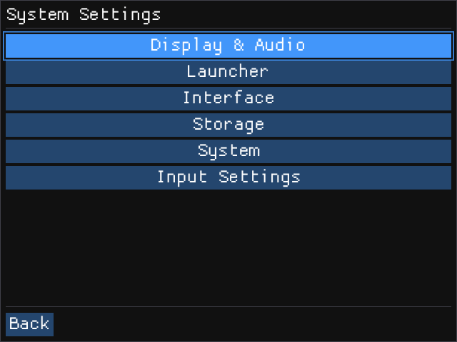 | 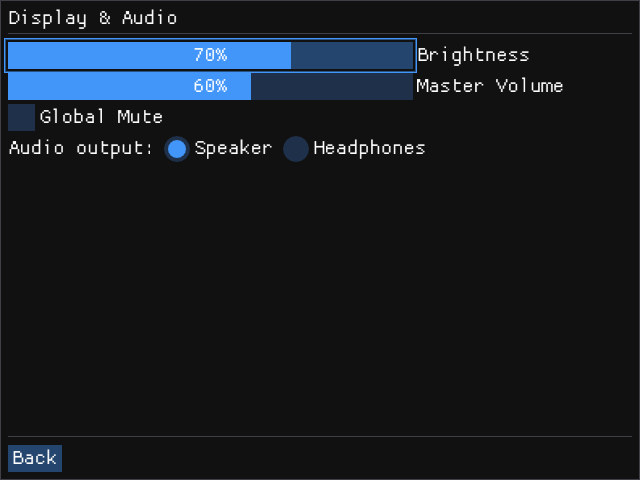 |
| Overlay | In-game status bar |
| 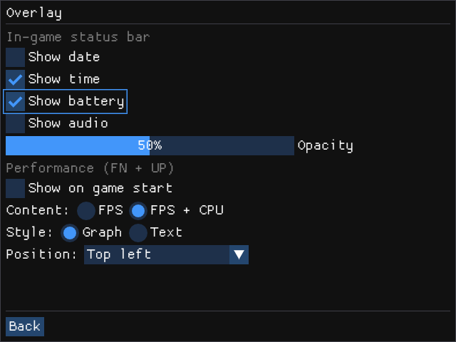 | 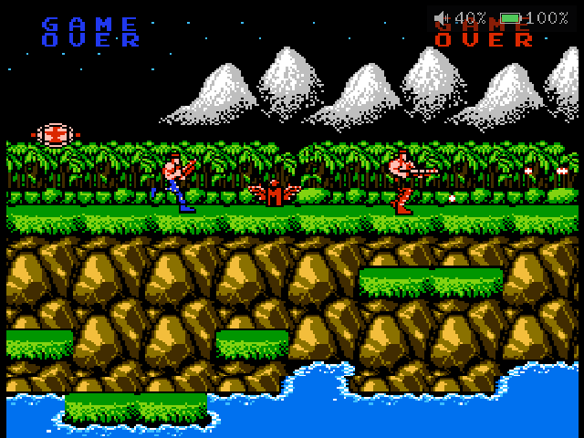 |
| Date & Time | Performance overlay in game (FN + D-pad up) |
| 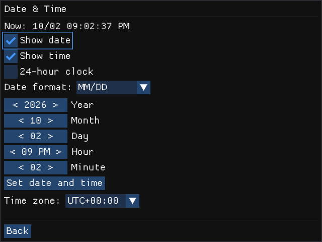 | 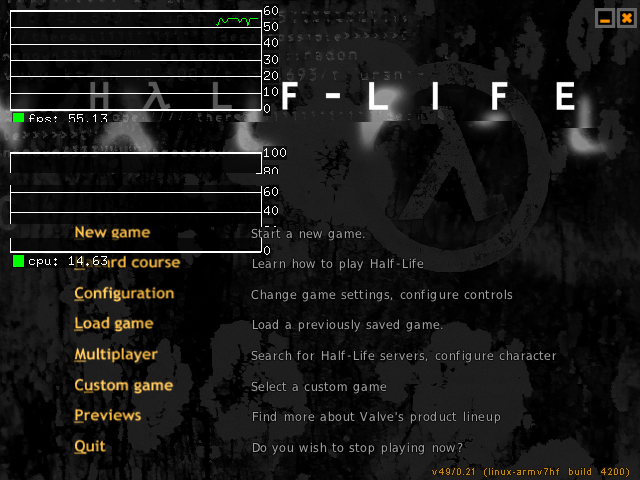 |

## Translations
Every text in the launcher, System Settings, the confirmation screens and `Resize Home` can be translated, and new languages need no code changes. Languages live in `/usr/share/goodluck/lang/<code>.lang` (in the repository: `rootfs/board/my-device/rootfs-overlay/usr/share/goodluck/lang/`) and show up in System Settings -> Interface -> Language as soon as the file is there.

To add a language:
1. Copy `pt-BR.lang` to a file named after your language's code, e.g. `es.lang` or `fr.lang`.
2. Change the first lines: `language` is the language's own name (`Español`) and `language_en` its English name (`Spanish`).
3. Translate the right side of each `English text = Translation` line. Keep the left side exactly as it is: it's the text the apps look up. Keep `%s` / `%d` where they are, and `\n` for line breaks.
4. Keep the launcher's bottom-bar words short (Prev, Next, Launch...): the bar is nearly full.
5. Optionally add your language's name to the other files (`Spanish = Espanhol` in `pt-BR.lang`), so the selector shows it in every language.

Anything left untranslated simply shows in English. Then open a pull request with the new file.

## What's wrong with the stock firmware?
Stock firmware:
- Based on ancient, unsupported forks of thelinux kernel version 3.4.
- Messy file system, hard to customize, even harder to clean.
- Full of broken/incompatible files.
- Come with inefficient, out-of-date emulator cores.
- Software often not compiled with optimal compiler flags.
- Usually uses swap-on-sd card, which will prematurely kill your expensive microSD card.
- Slow boot time
- Bad/no hotkeys
- Can't be flashed to smaller SD cards.
- The MBR (at least on the GA36-MB) is broken by default. You can't add games unless you manually fix it with my [guide](https://gist.github.com/CodeZombie/83be58b000ee6a14c7b91a6027a8eedf)

## How Do I Install goodluckOS?
1. Make an image of the microSD card that came with your device (at least its first 128mb), e.g. with Win32 Disk Imager or `dd if=/dev/sdx of=stock_sdcard.img bs=1M count=128`. It holds your board's boot data, which goodluckOS needs. Keep it: it's also your way back to the stock firmware.
2. Download the goodluckOS image for your SoC from [Releases](https://github.com/CodeZombie/goodluckOS/releases) (A33 and A23 builds are not interchangeable) and extract it
3. Open the [Firmware Builder](https://codezombie.github.io/goodluckOS/download.html), load your card image and the goodluckOS image, and download your personalised image. Don't flash the release image directly: without your board's boot data it won't start.
4. Flash your image to a good microSD card of at least 1gb with [balenaEtcher](https://etcher.balena.io/), [Rufus (in DD mode)](https://rufus.ie/en/), [dd](https://man7.org/linux/man-pages/man1/dd.1.html), etc
5. Plug the micro SD card into TF Slot 1 (TF1-OS) on your GA36-MB and power it on.
6. [optional] Select the `Resize Home` application in the launcher (or in System Settings) to expand your HOME partition to fill all the remaining space on your SD card. Do it before copying your games: HOME is backed up to RAM while it's resized. You only need to do this once, after that it's hidden from the launcher.

## How do I add games?
Plug the console into your PC with a USB cable and open `GA36MB -> HOME` (Windows: This PC; Linux: your file manager; macOS needs an MTP app such as [OpenMTP](https://openmtp.ganeshrvel.com/)). Or plug the SD card into your PC and open up the HOME partition. In there you'll find a `roms` folder with a few subfolders for each system. Add your roms to those.

If the console was connected to a charger when it booted (no PC), restart it before plugging it into a PC to get MTP; the serial console works either way. Games copied while Puppy is open show up after you reopen it.

Already have a scraped collection (e.g. made with [Skraper](https://www.skraper.net/) for EmulationStation)? Copy it as it is, `gamelist.xml` and `media` folder included: Puppy reads them.

To add custom art to Puppy, add an image file into the `icons` folder in your rom folder with the same name as the rom file. (eg. if your game is `roms/snes/super-mario.smc`, your image would be `roms/snes/icons/super-mario.png`)

Puppy also reads a `gamelist.xml` in the rom folder (as written by Skraper or EmulationStation): it takes each game's name, description, year/genre/players and image from it. An image in `icons` still wins over the gamelist's. With the interface in another language, a `gamelist.<code>.xml` next to it (e.g. `gamelist.pt-BR.xml`, written by a scraper pass in that language) supplies that language's names, descriptions and genres; images and anything it lacks still come from `gamelist.xml`. Big images are scaled down once and cached in `~/.cache/puppy/thumbs`.

### Can I add my own archives?
You sure can!

To add a new emulator, find an appropriate armhf libretro core .so file (e.g. from the [libretro buildbot](https://buildbot.libretro.com/nightly/linux/armhf/latest/)). Add it to either:
1. The `/usr/lib/libretro` folder in the `linux` partition, or
2. Anywhere in your HOME partition, e.g. a `cores` folder

Then modify `HOME -> apps.puppy` with a new `[ARCHIVE]` entry, pointing the COMMAND to your new libretro core. Take a look at `HOME -> apps.puppy` for an exmaple.

## Does goodluckOS come with any games?
Only Doom, through Chocolate Doom.

goodluckOS will never be distributed with unauthorized copyright protected materials. If you own the copyright to any games or demos (or know of any permissively-licensed/CC games) that you think might make a good fit, please open an Issue! I'd love to include some high quality games with the OS by default.

## About Ports
Some subset of portmaster games could theoretically work, however I want to tamper your expectations a little bit before we all start getting too excited.
The Allwinner A23/A33 is a 32-bit SoC. This means that 64-bit software simply _cannot_ run on it. There are a number of popular android ports that exist only as aarch64 (64-bit) distributions. Those will never work. Additionally, even with ZRAM there, the device is still heavily RAM-limited, so unoptimized games (I'm looking at you, Balatro) will struggle to run without patching.

With that said, most of the games people actually care about (Stardew Valley, Half-Life 1, n64 re-comps, Android GameMaker games, OpenMW, OpenRCT2, + more) are 32-bit games, and therefore should theoretically work if anyone cares to create 32-bit ports.
## How Do I Build It?
GoodluckOS uses a novel four-step containerized build system featuring Buildroot. This means the OS can be configured and built extremely easily and portably with no extra dependencies at all besides Docker and Docker Compose (or Podman).

Take a look at [BUILD.MD](BUILD.md) for instructions and guidelines.

## LICENSE
This project is licensed under the GNU GENERAL PUBLIC LICENSE VERSION 2.0 see the [LICENSE](LICENSE) file for details.

## DISCLAIMER
**WARNING**: The GNU General Public License v2 covers this in more detail, but to re-iterate: This software has the potential to permanently damage your hardware. You alone are responsible for _all_ damages, and the ensuing results of said damages that may occur as a result of using, or attempting to use this software.
